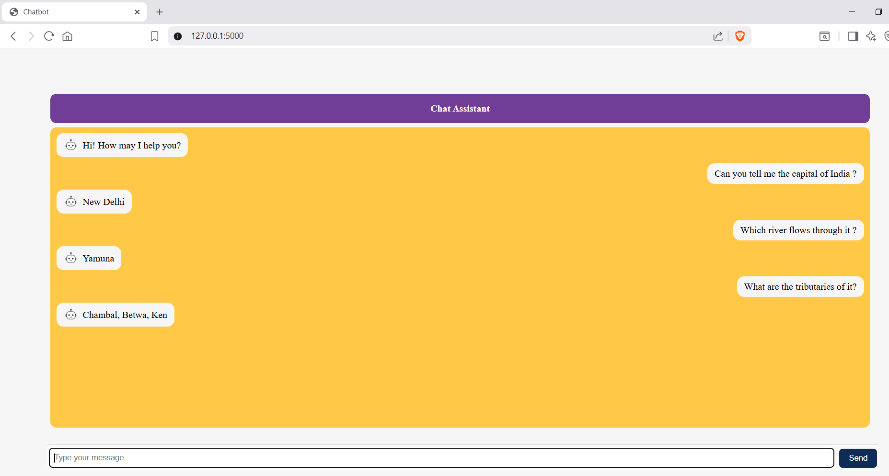

### Chatbot using Flask & Gemini LLM

This is a simple web-based chatbot application built using **Flask** as the backend and **Gemini (Google's LLM)** for natural language responses. The frontend is designed using **HTML/CSS/JavaScript** and supports image-based avatars and message alignment.

---

### 🔧 Technologies Used

- **Backend:** Python, Flask
- **Frontend:** HTML, CSS, JavaScript
- **AI Model:** Gemini API `gemini-2.0-flash`
- **Others:** dotenv for API key management

---

### 📸 Project Screenshot



---

### 📁 Project Structure
```
Project:.
├───static
│ ├───css
│ │ └───Chatbot_CSS.css
│ ├───js
│ │ └───script.js
│ └───chatbot_image.png
├───templates
│ └───index.html
├───app.py
├───.env
└───requirements.txt
```
---

